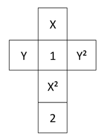
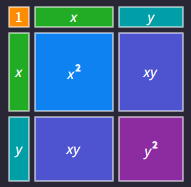
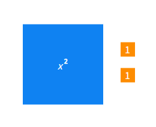
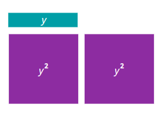
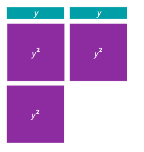
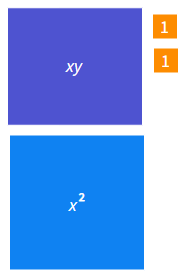

# AlgeRoll - Especificación funcional, técnica y banco de imágenes

**Versión de especificación:** 1.2 - MVP navegable local  
**Destino:** implementación asistida por OpenCode, Codex u otro agente de desarrollo en un equipo local  
**Tipo de producto:** juego de mesa virtual educativo, ejecutado en navegador, sin backend en el MVP  
**Idioma de interfaz:** español  
**Jugadores:** 1 a 5, en un único dispositivo y por turnos  
**Edad de referencia del material original:** 11+  
**Duración de referencia del material original:** aproximadamente 20 minutos  
**Autoría indicada en el material original:** Viviana Bermudez  

---

## 0. Cómo leer esta especificación

Este documento es la fuente de verdad para desarrollar el primer prototipo funcional de **AlgeRoll**. Consolida tres tipos de información y usa las siguientes etiquetas cuando conviene distinguirlas:

- **[FUENTE]**: regla o contenido presente en los archivos originales `AlgeRoll - Instrucciones.pdf` y `AlgeRoll - cartas.docx`.
- **[ACORDADO]**: decisión confirmada expresamente durante la definición del prototipo.
- **[DECISIÓN MVP]**: interpretación técnica o funcional introducida aquí para eliminar ambigüedades de implementación sin cambiar la intención del juego.

### Orden de autoridad en caso de conflicto

1. Las decisiones **[ACORDADO]** de esta especificación prevalecen sobre el material físico original.
2. El material original **[FUENTE]** completa lo que no haya sido modificado explícitamente.
3. Las **[DECISIÓN MVP]** sirven para hacer el comportamiento implementable y deben estar encapsuladas para poder cambiarlas después sin reescribir el juego.

Ejemplo importante: el archivo de cartas contiene un reto llamado **“Expresión con 5 términos”**, pero para la versión virtual se ha decidido disponer de exactamente **4 cajas de términos** y **eliminar ese reto**. Por tanto, la versión digital no debe incluir esa carta.

### 0.1 Aclaración de estrategia visual (v1.2)

**[ACORDADO]** El juego **no debe generar imágenes mediante IA ni mediante servicios externos durante la ejecución**. El banco de imágenes entregado con esta especificación es un conjunto de **assets estáticos y referencias visuales procedentes de los materiales originales**, no un requisito para convertir toda la interfaz en imágenes.

La estrategia visual obligatoria del MVP es híbrida:

- usar **assets estáticos originales** para identidad, decoración y retos que necesiten una representación gráfica concreta (por ejemplo, algeplano);
- construir con **HTML/CSS/SVG y componentes React** todos los elementos interactivos del juego: dados, caras, cartas de texto, cajas de términos, fichas virtuales, botones, indicadores, signos matemáticos, estados de selección y bloqueos;
- no llamar a ninguna API de generación de imágenes, modelo generativo, servicio de imágenes ni CDN obligatoria para que una partida funcione;
- el proyecto debe poder ejecutarse localmente y conservar toda su funcionalidad visual esencial sin conexión a Internet una vez instaladas sus dependencias.

---

### 0.2 Nota de implementación visual de dados (v1.3)

**[ACORDADO / CORRECCIÓN DE IMPLEMENTACIÓN]** Los cinco dados deben percibirse inequívocamente como **cubos tridimensionales**, no como cuadrados planos. Cada dado conserva físicamente las seis caras `1`, `2`, `x`, `y`, `x²`, `y²`, con pares opuestos `1↔2`, `x↔x²` y `y↔y²`.

La implementación separa dos transformaciones 3D: (1) la orientación interior que coloca la cara obtenida hacia el usuario y (2) una envolvente exterior que **solo rota durante el lanzamiento** y aterriza sin inclinación residual. En reposo el cubo queda **alineado con la pantalla mostrando una sola cara**: la del resultado aleatorio. Se eliminó la inclinación isométrica estable (v1.2) porque dificultaba leer la cara obtenida.

Reglas de construcción obligatorias del cubo:

- el 3D se define dentro de la escena (`perspective` + `transform-style: preserve-3d`); **ningún contenedor del árbol 3D puede llevar `filter`, `opacity` ni propiedades de agrupación** (las aplanan las caras y el dado se percibe como una tarjeta plana que solo muestra su cara frontal);
- la orientación de cada resultado debe ser fiable y correcta, incluida la vertical de `y`/`y²`;
- los exponentes de `x²`/`y²` deben dibujarse como **superíndice real**; el símbolo debe envolverse en un contenedor inline para que el `<sup>` no se convierta en una celda propia dentro del contenedor grid de la cara;
- la etiqueta identificadora del dado (`#1…#5`) se coloca **debajo del cubo, en flujo normal**, fuera del espacio 3D, para que ninguna cara pueda ocultarla;
- la bandeja reserva **cinco posiciones visibles**: mientras un dado esté en una caja de término, su posición muestra el marcador “En la expresión” y el usuario siempre reconoce que existen exactamente cinco dados físicos;
- el resultado se muestra en la propia cara del cubo; **no** se requiere una píldora textual redundante bajo el dado;
- el `hover` no debe volver a girar el dado después del lanzamiento: únicamente puede elevarlo o resaltarlo.

La animación de lanzamiento debe ser suficientemente pausada para apreciar el giro 3D, con una duración aproximada de 3,5 a 3,9 segundos incluyendo pequeños desfases entre dados, y debe terminar **sin giro residual** sobre la cara obtenida.

---

# PARTE I - DOCUMENTACIÓN FUNCIONAL

## 1. Visión del producto

AlgeRoll es un juego educativo de álgebra en el que cada lanzamiento de cinco dados especiales proporciona símbolos numéricos y literales que el jugador debe combinar para construir expresiones algebraicas y resolver retos visibles en la mesa.

El prototipo no debe sentirse como una calculadora ni como un formulario matemático. La experiencia debe conservar la sensación de **juego de mesa físico**: dados que se lanzan, cartas que se seleccionan, fichas que se arrastran, zonas de juego claramente delimitadas y feedback inmediato.

### 1.1 Objetivo general del juego

**[FUENTE]** El objetivo es resolver retos de las cartas utilizando suma y multiplicación de los resultados de los dados, y conseguir la mayor puntuación acumulando los puntos de las cartas de reto obtenidas.

### 1.2 Objetivos educativos presentes en el material original

El material original declara los siguientes objetivos didácticos:

- Traducir resultados numéricos y literales en expresiones algebraicas.
- Evaluar expresiones asignando valores a las variables.
- Comprender la estructura de una expresión: término, coeficiente y exponente.
- Usar varios registros de representación, incluyendo representaciones tipo algeplano.

La implementación debe preservar estos objetivos. En particular, los retos representados con algeplano no deben sustituirse únicamente por texto algebraico visible: el **asset estático correspondiente extraído del material original** debe mantenerse como parte visible del reto y la expresión equivalente debe permanecer como dato interno del validador. Ese recurso se carga desde el proyecto; no se genera dinámicamente ni mediante IA.

---

## 2. Alcance del MVP

### 2.1 Incluido

- Juego ejecutable en navegador moderno.
- Modo de 1 jugador.
- Modo de 2 a 5 jugadores por turnos en un mismo dispositivo.
- Cinco dados especiales virtuales.
- Animación de lanzamiento de los cinco dados.
- Arrastrar y soltar dados hacia cuatro cajas de términos.
- Multiplicación automática de todos los elementos colocados dentro de una misma caja.
- Suma automática entre las cajas de términos.
- Simplificación algebraica automática.
- Cuatro retos visibles en la mesa.
- Selección de reto y comprobación automática.
- Uso de cartas de ayuda, tanto sobre dados como sobre términos/expresión.
- Hasta dos retos ganados por turno utilizando conjuntos de dados disjuntos.
- Botón de **Pasar turno**.
- Puntuación por dificultad.
- Final de partida y pantalla de resultados.
- Banco de assets estáticos y referencias visuales procedente de los documentos originales.
- Componentes interactivos renderizados por código (HTML/CSS/SVG/React), no por generación de imágenes.
- Diseño visual inspirado en los colores, papeles rasgados y estética de las instrucciones originales.

### 2.2 Fuera del MVP

- Multijugador en red.
- Cuentas de usuario.
- Backend o base de datos remota.
- Rankings online.
- Chat.
- Inteligencia artificial rival.
- Generación de imágenes mediante IA durante la partida o durante el arranque de la aplicación.
- Dependencia de APIs externas de generación de imágenes para renderizar el juego.
- Editor gráfico de nuevas cartas dentro de la aplicación.
- Retos pendientes que estaban vacíos en el documento fuente.
- La carta de reto “Expresión con 5 términos”.
- Aplicación móvil nativa.

### 2.3 Extensiones futuras recomendadas

- PWA instalable.
- Guardado/restauración de partida en `localStorage`.
- Editor JSON de cartas.
- Nuevos mazos y niveles.
- Estadísticas de aprendizaje.
- Multijugador en red.
- Sonido opcional de dados/cartas.

---

## 3. Materiales y parámetros base

### 3.1 Material físico de referencia

**[FUENTE]** El juego original indica:

- 5 dados especiales.
- 40 cartas de ayuda.
- 30 cartas de retos.
- 1 a 5 jugadores.
- Duración aproximada de 20 minutos.
- Edad de referencia 11+.
- Empieza quien saque 1.

### 3.2 Material digital del MVP

Debido a que el documento de cartas contiene casillas de reto todavía vacías y a que se ha eliminado el reto de cinco términos, el mazo digital inicial queda así:

- **5 dados especiales**.
- **40 cartas de ayuda**, manteniendo exactamente la distribución del documento fuente.
- **20 cartas de reto activas e implementables** en la versión inicial.
- **9 espacios de reto pendientes** identificados en el documento fuente y reservados para una futura ampliación.
- **1 reto eliminado por decisión de producto:** “Expresión con 5 términos”.

El sistema de cartas debe ser **data-driven** para añadir los retos pendientes posteriormente sin modificar el motor de juego.

---

## 4. Dados especiales

### 4.1 Caras

**[ACORDADO]** Los cinco dados son funcionalmente idénticos. Cada dado tiene exactamente estas seis caras:

1. `1`
2. `2`
3. `x`
4. `y`
5. `x²`
6. `y²`

### 4.2 Caras opuestas

**[ACORDADO]** Las parejas de caras opuestas son:

- `1 <-> 2`
- `x <-> x²`
- `y <-> y²`

Esta relación es obligatoria para la carta de ayuda **“Cambia un dado por su cara opuesta”**.

### 4.3 Lanzamiento

El botón principal **“Lanzar dados”** debe:

1. Lanzar simultáneamente los cinco dados al inicio del turno.
2. Reproducir una animación visible de giro/tumbling para los cinco dados.
3. Resolver cada dado de manera aleatoria a una de las seis caras.
4. Mostrar el resultado definitivo después de la animación.
5. Deshabilitar temporalmente acciones incompatibles mientras los dados están girando.

**[DECISIÓN MVP]** Duración sugerida de animación: 700-1000 ms, con pequeños desfases entre dados para evitar un movimiento robótico. Respetar `prefers-reduced-motion`.

### 4.4 Aleatoriedad

Cada cara debe tener la misma probabilidad nominal: `1/6`.

No debe existir ponderación por dificultad, turno, jugador ni cartas visibles.

### 4.5 Orden libre

**[ACORDADO]** Los dados se pueden reordenar libremente. El orden visual en el que aparecen o se arrastran no cambia el valor matemático del término, porque la multiplicación es conmutativa.

### 4.6 Uso parcial

**[ACORDADO]** El jugador puede utilizar cualquier cantidad de sus cinco dados. No está obligado a usar todos.

Los dados no utilizados permanecen disponibles para reorganizar el intento o para un posible segundo reto del mismo turno.

### 4.7 Un dado no se duplica

**[ACORDADO]** Cada dado físico virtual puede utilizarse una sola vez dentro de un reto. No puede clonarse ni aparecer simultáneamente en dos cajas.

Solo las cartas de ayuda que explícitamente crean términos/fichas virtuales pueden añadir contenido adicional. Esos elementos no son copias del objeto `Die` físico.

---

## 5. Operaciones matemáticas permitidas

### 5.1 Operaciones

**[ACORDADO]** Solo se permiten:

- suma (`+`)
- multiplicación (`×`)

No se permiten:

- resta
- división
- paréntesis
- potencias escritas manualmente
- introducir una expresión libre por teclado

Las potencias surgen únicamente como resultado de multiplicar factores, por ejemplo `x × x = x²`, o mediante una cara/ficha `x²`/`y²`.

### 5.2 Sin paréntesis

**[ACORDADO]** No se permiten paréntesis. La estructura de la interfaz debe hacerlos innecesarios:

- todo lo que está dentro de una caja se multiplica;
- las cajas se suman entre sí.

---

## 6. Constructor visual de expresiones

### 6.1 Cuatro cajas fijas de términos

**[ACORDADO]** Deben existir exactamente cuatro zonas visibles:

- Término 1
- Término 2
- Término 3
- Término 4

No existe botón para añadir una quinta caja.

### 6.2 Regla de multiplicación dentro de una caja

Todos los dados y fichas colocados en una misma caja se multiplican.

Ejemplo:

- contenido: `[2] [x] [x]`
- expresión interna: `2 × x × x`
- término simplificado: `2x²`

### 6.3 Regla de suma entre cajas

Cada caja no vacía representa un sumando. Las cuatro cajas se conectan mediante suma.

Ejemplo:

- Término 1: `[2] [x]` -> `2x`
- Término 2: `[y] [y]` -> `y²`
- Término 3: `[1]` -> `1`
- Término 4: vacío

Expresión construida:

`2 × x + y × y + 1`

Expresión simplificada:

`2x + y² + 1`

### 6.4 Drag and drop

**[ACORDADO]** El jugador puede:

- arrastrar un dado desde la zona de dados a una caja;
- mover un dado de una caja a otra;
- devolver un dado desde una caja a la zona de dados;
- reordenar visualmente dados dentro de la misma caja;
- hacer todo lo anterior mientras el dado no esté bloqueado por un reto ya ganado.

Al pasar por encima de una caja válida, la caja debe iluminarse.

Al soltar el dado, debe existir una pequeña respuesta visual de caída/encaje.

### 6.5 Click-to-place alternativo

**[DECISIÓN MVP de accesibilidad]** Además de arrastrar, debe existir un mecanismo alternativo mediante clic/toque:

1. seleccionar un dado;
2. seleccionar la caja destino.

Esto permite uso táctil y accesibilidad por teclado sin depender exclusivamente de drag and drop.

### 6.6 Orden visual vs. simplificación

**[DECISIÓN MVP]** La caja conserva visualmente el orden elegido por el jugador. Debajo o en una banda de resumen se muestra el término simplificado. La normalización matemática nunca depende del orden visual.

---

## 7. Simplificación algebraica

### 7.1 Reglas básicas confirmadas

**[ACORDADO]** Se aplican automáticamente las reglas algebraicas normales, incluyendo:

- `x × x = x²`
- `y × y = y²`
- `2 × x = 2x`
- `x × y = xy`
- `2 × x × y = 2xy`
- `x² × x = x³`
- `x² × y² = x²y²`
- combinación de términos semejantes entre cajas: `x + x = 2x`

### 7.2 Los retos se comprueban sobre la expresión simplificada

**[ACORDADO]** La comprobación usa la expresión simplificada.

Ejemplo:

`x + x + 1` -> `2x + 1`

Por tanto, el reto “Expresión con dos términos” se considera cumplido porque la forma simplificada tiene dos términos (`2x` y `1`).

### 7.3 Excepción estructural documentada

Existe un reto fuente: **“Expresión donde un término sea el doble de otro”**. Si se combinaran obligatoriamente términos semejantes antes de observar la relación, una construcción como `2x + x` se convertiría en `3x` y la relación visual desaparecería.

**[DECISIÓN MVP]** Para este reto específico se valida la lista de **términos construidos simplificados individualmente antes de combinar términos semejantes entre cajas**. Deben existir dos cajas no vacías A y B con la misma parte literal y coeficientes donde uno sea exactamente el doble del otro.

Ejemplo válido para este reto:

- caja A = `2 × x` -> `2x`
- caja B = `x` -> `x`

Aunque la expresión global pueda mostrarse también como `3x`, el reto estructural se considera cumplido por la relación entre las cajas A y B.

Esta excepción debe estar aislada dentro del validador de ese reto y no alterar los demás.

---

## 8. Preparación de la partida

### 8.1 Selección de jugadores

Pantalla inicial:

1. elegir número de jugadores: 1-5;
2. introducir nombre para cada jugador;
3. iniciar partida.

Si un nombre se deja vacío, usar `Jugador N`.

### 8.2 Barajar mazos

Al iniciar:

- crear las 40 instancias de cartas de ayuda según sus cantidades;
- barajar el mazo de ayuda;
- crear las instancias de retos activas;
- barajar el mazo de retos.

### 8.3 Reparto inicial

**[FUENTE]** Cada jugador recibe 2 cartas de ayuda.

Las cartas restantes forman el mazo de ayuda boca abajo.

### 8.4 Retos visibles

**[FUENTE]** Se extraen 4 retos del mazo y se colocan visibles en el centro.

### 8.5 Determinar primer jugador

**[FUENTE]** “Empieza quien saque 1”.

**[DECISIÓN MVP]** En multijugador local se implementará una fase de inicio:

- los jugadores, en el orden de registro, lanzan virtualmente un dado especial;
- el primer jugador que obtenga `1` comienza;
- si termina una ronda completa sin que aparezca `1`, se repite;
- en modo de un jugador esta fase se omite.

**[ACORDADO v1.3.1]** El resultado de la tirada inicial se muestra **en la propia cara del cubo** al terminar el giro; **no** se muestra un texto redundante con el valor (p. ej. “Ha salido …”). El giro aterriza ya orientado a la cara obtenida, sin re-render que vuelva a mostrar el valor.

Esta tirada inicial no afecta los cinco dados de la partida ni consume cartas.

---

## 9. Flujo completo de un turno

### 9.1 Inicio

Mostrar:

- jugador actual;
- puntuación actual;
- cartas de ayuda en mano;
- cuatro retos visibles;
- cinco dados sin lanzar o preparados para el nuevo turno;
- cuatro cajas vacías;
- botón **Lanzar dados**.

### 9.2 Lanzar dados

El jugador pulsa **Lanzar dados** y se resuelven las cinco caras.

A partir de este momento se habilitan:

- construcción de términos;
- cartas de ayuda aplicables;
- selección de retos;
- botón **Pasar turno**.

### 9.3 Modificar dados mediante ayudas

El jugador puede usar una o varias cartas de ayuda durante el turno, como indica el reglamento original.

Las cartas que afectan dados deben entrar en un modo de selección explícito. Ejemplo:

`Vuelve a tirar hasta 2 dados` -> resaltar dados seleccionables -> elegir 1 o 2 -> confirmar -> animar únicamente esos dados.

### 9.4 Construir expresión

El jugador arrastra dados y fichas virtuales a las cajas.

La expresión construida y simplificada se recalcula en tiempo real.

### 9.5 Modificar términos o expresión

El jugador puede usar ayudas que actúan sobre:

- una caja/término;
- una ficha/factor de la expresión;
- la expresión completa.

### 9.6 Seleccionar reto

Solo puede haber un reto seleccionado para comprobar en cada instante.

La carta seleccionada debe tener un estado visual evidente.

### 9.7 Comprobar reto

Botón: **“Comprobar reto”**.

Validaciones previas:

- debe existir al menos una caja no vacía o un modificador de expresión que genere una expresión válida;
- debe existir un reto seleccionado;
- si el reto requiere respuesta numérica, el campo de respuesta debe estar completo.

### 9.8 Si falla

**[ACORDADO]** El intento no se pierde.

Mostrar un mensaje claro, por ejemplo:

> Todavía no cumple el reto. Puedes modificar la expresión y volver a intentarlo.

El jugador puede:

- mover dados;
- elegir otro reto;
- usar más ayudas;
- volver a comprobar.

No existe límite de comprobaciones por turno.

### 9.9 Si gana el primer reto

- La carta pasa a la colección del jugador.
- Se suman sus puntos.
- Todos los **dados físicos utilizados** en esa expresión quedan bloqueados para el resto del turno.
- Las ayudas de expresión/fichas virtuales utilizadas en ese intento no se transfieren a un segundo reto.
- Las cajas se limpian para construir una nueva expresión con los dados físicos restantes.
- Los retos visibles no se reponen todavía: el segundo intento se realiza con los retos que siguen sobre la mesa.

**[FUENTE]** Un mismo dado no puede usarse para dos retos distintos.

### 9.10 Segundo reto

**[FUENTE]** El jugador puede llevarse una segunda carta si puede resolver otro reto con los dados restantes.

Máximo: **2 retos ganados por turno**.

Después del segundo reto el turno termina.

### 9.11 Pasar turno

**[ACORDADO]** Debe existir un botón visible **“Pasar turno”** después de lanzar los dados.

No es necesario que el software demuestre matemáticamente que ningún reto puede cumplirse. El jugador decide cuándo dejar de intentarlo.

Comportamiento:

- Si el jugador no ganó ningún reto: termina el turno y roba **1 carta de ayuda** para usar en un turno posterior.
- Si el jugador ya ganó 1 reto: puede terminar voluntariamente el turno, pero **no roba ayuda**.
- Si ganó 2 retos: el turno finaliza sin ayuda adicional.

**[FUENTE]** Si no logra cumplir ningún reto, obtiene una carta de ayuda para el siguiente turno.

### 9.12 Fin de turno y reposición

**[FUENTE]** Al finalizar el turno se completan las cartas visibles hasta volver a tener 4 retos, utilizando el mazo.

Después:

- limpiar estados de turno;
- descartar efectos temporales de expresión;
- desbloquear/preparar los cinco dados para el siguiente jugador;
- avanzar al siguiente jugador.

---

## 10. Final de partida

### 10.1 Condición

**[FUENTE]** La partida termina cuando se acaba uno de los mazos: ayuda o retos.

**[DECISIÓN MVP]** Para evitar un corte abrupto dentro de una acción, el sistema marca el agotamiento y cierra la partida al terminar el turno actual. Si durante la reposición no se puede volver a completar la mesa por haberse agotado el mazo de retos, se muestra directamente el resultado final.

### 10.2 Multijugador

Cada jugador suma los puntos obtenidos.

Gana quien tenga la puntuación mayor.

**[ACORDADO]** Los empates están permitidos. Si dos o más jugadores comparten la puntuación máxima, todos aparecen como ganadores empatados. No existe desempate.

### 10.3 Un jugador

**[ACORDADO]** El objetivo es obtener la máxima puntuación posible hasta que la partida termine.

Con el mazo inicial de 20 retos activos y la puntuación 1/2/3 definida más adelante, el máximo teórico de puntos del mazo actual es **35 puntos**, aunque la partida puede terminar antes por agotamiento del mazo de ayuda.

La pantalla final debe mostrar como mínimo:

- puntuación obtenida;
- número de retos ganados;
- desglose por dificultad;
- máximo teórico del mazo activo, si se desea mostrar contexto (`X / 35`).

---

## 11. Puntuación

**[DECISIÓN MVP aceptada para el prototipo]**:

| Dificultad | Puntos |
|---|---:|
| Fácil | 1 |
| Intermedio | 2 |
| Difícil | 3 |

Esta regla debe estar en configuración/datos, no hardcodeada en componentes visuales, para poder balancearla en pruebas.

Colores de dificultad del documento fuente:

| Dificultad | Color fuente |
|---|---|
| Fácil | `#D9E2F3` |
| Intermedio | `#FFFF00` |
| Difícil | `#EE0000` |

---

# 12. Cartas de ayuda - mazo completo de 40

## 12.1 Reglas generales

**[FUENTE]**:

- cada jugador comienza con 2 cartas;
- se pueden usar una o varias en un mismo turno;
- una carta usada se descarta;
- las ayudas permiten relanzar dados o cambiar resultados, además de otros efectos listados en el mazo.

### Ciclo de uso digital

1. jugador pulsa una carta de su mano;
2. el sistema comprueba si actualmente puede jugarse;
3. si requiere objetivo, entra en modo selección;
4. el jugador selecciona objetivo(s);
5. pulsa Confirmar;
6. se aplica el efecto;
7. la carta pasa a la pila de descarte.

Si el jugador cancela **antes de confirmar**, la carta vuelve a su mano.

Después de confirmar, el uso es irreversible.

## 12.2 Distribución exacta

La suma de cantidades de la siguiente tabla es 40 y reproduce el documento fuente.

| ID | Cant. | Texto | Categoría | Comportamiento digital |
|---|---:|---|---|---|
| H01 | 2 | Multiplica un término por 3 | Término | Seleccionar una caja no vacía. Multiplicar el valor del término por 3. Mostrar badge `×3`. |
| H02 | 2 | Añade un término que sí tengas (Debe ser exactamente igual) | Expresión | Seleccionar un término existente y una caja vacía. Crear en la caja destino una copia virtual exactamente igual al término seleccionado. |
| H03 | 2 | Cambia un dado por su cara opuesta | Dado | Seleccionar 1 dado físico no bloqueado y cambiar según `1<->2`, `x<->x²`, `y<->y²`. |
| H04 | 2 | Añade un término que no tengas (ej. 4x²) | Expresión | Seleccionar una caja vacía. Mostrar las seis caras como opciones de ficha. Permitir componer libremente el nuevo término y confirmar solo si su valor simplificado no coincide con ningún término ya presente. |
| H05 | 2 | Añade las X que quieras | Fichas/expresión | Seleccionar una caja. Mostrar botón/ficha `+x`; cada pulsación añade un factor virtual `x`. Sin límite lógico; al menos 1. |
| H06 | 2 | Convierte un término en 1 | Término | Seleccionar caja no vacía. El valor efectivo de ese término pasa a `1`. Conservar la procedencia de los dados para que sigan considerándose usados si se gana el reto. |
| H07 | 2 | Añade las Y que quieras | Fichas/expresión | Igual que H05, usando factor virtual `y`. |
| H08 | 2 | Cambia una Y por una X | Factor de expresión | Seleccionar exactamente un factor efectivo `y` dentro de la expresión y transformarlo a `x`. |
| H09 | 3 | Vuelve a tirar hasta 3 dados | Dado | Seleccionar entre 1 y 3 dados físicos no bloqueados y relanzarlos con animación. |
| H10 | 1 | Vuelve a tirar los dados que quieras | Dado | Seleccionar entre 1 y todos los dados físicos no bloqueados y relanzarlos. |
| H11 | 4 | Vuelve a tirar hasta 2 dados | Dado | Seleccionar 1 o 2 dados físicos no bloqueados y relanzarlos. |
| H12 | 2 | Suma 2 a tu expresión | Expresión global | Añadir un modificador `+2` a la expresión actual. No requiere una quinta caja y puede combinarse con el término constante al simplificar. |
| H13 | 2 | Cambia una X por una Y | Factor de expresión | Seleccionar exactamente un factor efectivo `x` y transformarlo a `y`. |
| H14 | 2 | Modifica un dado para elegir la cara que quieras | Dado | Seleccionar 1 dado no bloqueado; mostrar `1,2,x,y,x²,y²`; elegir una nueva cara. |
| H15 | 2 | Modifica 2 dados como quieras | Dado | Seleccionar exactamente 2 dados no bloqueados; elegir la cara de cada uno. |
| H16 | 2 | Duplica un término | Término | Seleccionar caja no vacía y duplicar su valor, equivalente a multiplicarlo por 2 dentro de la misma caja. Mostrar badge `×2`. |
| H17 | 2 | Cambia una Y² por una X² | Factor de expresión | Seleccionar un factor efectivo `y²` y transformarlo en `x²`. |
| H18 | 2 | Cambia una X² por una Y² | Factor de expresión | Seleccionar un factor efectivo `x²` y transformarlo en `y²`. |
| H19 | 1 | Añade hasta 3x² | Fichas/expresión | Seleccionar caja; añadir 1, 2 o 3 factores virtuales `x²`. |
| H20 | 1 | Añade hasta 3y² | Fichas/expresión | Seleccionar caja; añadir 1, 2 o 3 factores virtuales `y²`. |

### 12.3 Fichas virtuales generadas por ayudas

**[ACORDADO]** Algunas ayudas generan contenido que no procede de los cinco dados físicos.

Reglas:

- deben verse diferentes de un dado físico, por ejemplo como fichas/chips con borde punteado;
- deben mostrar claramente `x`, `y`, `x²`, `y²`, `1` o `2`;
- pertenecen al intento de reto actual;
- no se consideran dados físicos y no entran en la regla “un mismo dado no puede usarse para dos retos”;
- no deben transferirse al segundo reto del turno;
- si hay muchas fichas idénticas, la UI puede agruparlas visualmente como `x × 12`, pero el modelo conserva la cantidad real;
- las cartas H05/H07 no tienen máximo de regla; no introducir un límite matemático artificial.

### 12.4 “Añade un término que no tengas”

**[ACORDADO]** Interacción específica:

1. usar H04;
2. iluminar las cajas de término disponibles;
3. seleccionar una caja vacía;
4. mostrar debajo las seis opciones `1`, `2`, `x`, `y`, `x²`, `y²`;
5. el jugador pulsa las opciones que quiera para construir el término;
6. se muestra la simplificación en tiempo real;
7. `Confirmar término` solo se habilita si:
   - contiene al menos un factor;
   - el término simplificado no es exactamente igual a ninguno de los términos ya presentes.

Ejemplo: seleccionar `2`, `2`, `x²` produce `4x²`.

### 12.5 Ayudas de dado vs. ayudas de expresión

Las ayudas de dado modifican el estado físico/efectivo del dado y persisten mientras ese dado siga disponible en el turno.

Las ayudas de término/expresión se asocian al intento de reto actual. Al ganar un reto y pasar al posible segundo intento, se reinician sus efectos y fichas virtuales.

### 12.6 Procedencia y bloqueo

Si un término fue modificado, convertido o multiplicado mediante ayuda, los `dieId` físicos que contribuyeron a ese término siguen formando parte de su procedencia. Si ese reto se gana, esos dados se bloquean para el resto del turno, aunque el valor final del término haya sido transformado.

Esto evita que una carta como “Convierte un término en 1” permita reciclar los mismos dados para un segundo reto.

---

# 13. Cartas de reto activas del MVP

## 13.1 Reglas generales

- Se muestran 4 retos al inicio de cada turno.
- Debe cumplirse lo que solicita la carta para ganarla.
- Al ganarla, se asignan los puntos de su dificultad.
- Los retos ganados se retiran de la mesa y se guardan en la colección del jugador.
- Los huecos se reponen al finalizar el turno.

## 13.2 Retos fáciles activos - 10 cartas

Puntuación: **1 punto** cada una.

| ID | Posición fuente | Contenido visible | Tipo de validación | Regla exacta |
|---|---|---|---|---|
| E01 | Fila 1, col. 1 | Expresión con dos términos | `TERM_COUNT` | La expresión global simplificada tiene exactamente 2 monomios no nulos. |
| E02 | Fila 1, col. 2 | Expresión que termine en +3 | `ENDS_CONSTANT_3` | La forma canónica tiene término constante `+3` y al menos un término no constante. El render canónico coloca la constante al final. |
| E03 | Fila 1, col. 3 | Expresión con tres términos | `TERM_COUNT` | Exactamente 3 monomios tras simplificar. |
| E04 | Fila 2, col. 1 | Expresión con un término cuadrático | `HAS_QUADRATIC_TERM` | Existe al menos un monomio de grado total 2 (`x²`, `xy`, `y²`, con cualquier coeficiente positivo). |
| E05 | Fila 2, col. 2 | `x² + y²` | `EXACT_POLYNOMIAL` | Igualdad algebraica exacta con `x² + y²`. |
| E06 | Fila 2, col. 3 | `x + x² + 1` | `EXACT_POLYNOMIAL` | Igualdad algebraica exacta; canónicamente `x² + x + 1`. |
| E07 | Fila 3, col. 1 | `y + y² + 1` | `EXACT_POLYNOMIAL` | Igualdad exacta; canónicamente `y² + y + 1`. |
| E08 | Fila 3, col. 2 | Imagen algeplano | `EXACT_POLYNOMIAL` | Imagen representa `x² + 2`. Mantener imagen visible, objetivo interno `x² + 2`. |
| E09 | Fila 4, col. 1 | `2x + 1` | `EXACT_POLYNOMIAL` | Igualdad exacta con `2x + 1`. |
| E10 | Fila 4, col. 2 | `y + 2` | `EXACT_POLYNOMIAL` | Igualdad exacta con `y + 2`. |

**Posiciones fáciles pendientes en el documento fuente:** fila 3 col. 3 y fila 4 col. 3. No crear contenido ficticio.

## 13.3 Retos intermedios activos - 5 cartas

Puntuación: **2 puntos** cada una.

| ID | Posición fuente | Contenido visible | Tipo | Regla exacta |
|---|---|---|---|---|
| I01 | Fila 5, col. 1 | Expresión para el perímetro de un triángulo equilátero cuyo lado mide x | `EXACT_POLYNOMIAL` | Debe simplificar exactamente a `3x`. |
| I02 | Fila 5, col. 2 | Expresión con 4 términos | `TERM_COUNT` | Exactamente 4 monomios no nulos después de simplificar. |
| I03 | Fila 5, col. 3 | Imagen algeplano | `EXACT_POLYNOMIAL` | Imagen representa `y + 2y²`. Objetivo interno `2y² + y`. |
| I04 | Fila 6, col. 1 | Expresión donde un término sea el doble de otro | `STRUCTURAL_DOUBLE_TERM` | Usar la excepción estructural descrita en §7.3. |
| I05 | Fila 6, col. 2 | Imagen algeplano | `EXACT_POLYNOMIAL` | Imagen representa `2y + 3y²`. Objetivo interno `3y² + 2y`. |

**Posiciones intermedias pendientes:** fila 6 col. 3 y todas las casillas de las filas 7 y 8 del bloque amarillo. No inventar cartas.

## 13.4 Retos difíciles activos - 5 cartas

Puntuación: **3 puntos** cada una.

| ID | Posición fuente | Contenido visible | Tipo | Regla exacta |
|---|---|---|---|---|
| D01 | Fila 9, col. 2 | `2x + 2y + 1` | `EXACT_POLYNOMIAL` | Igualdad exacta con `2x + 2y + 1`. |
| D02 | Fila 9, col. 3 | Di el resultado de tu expresión si: `x=1` y `y=4` | `EVALUATE_AND_ANSWER` | El jugador puede construir cualquier expresión válida; debe introducir el valor numérico de su expresión para `x=1, y=4`. El sistema calcula y compara la respuesta. |
| D03 | Fila 10, col. 1 | Si `x=3`, `y=1`, el resultado es `< 15` | `EVALUATION_PREDICATE` | Evaluar la expresión en `(3,1)` y comprobar valor `< 15`. |
| D04 | Fila 10, col. 2 | Imagen algeplano | `EXACT_POLYNOMIAL` | Imagen representa `xy + x² + 2`. Objetivo interno `x² + xy + 2`. |
| D05 | Fila 10, col. 3 | Si `x=1`, `y=3`, el resultado es `< 7` | `EVALUATION_PREDICATE` | Evaluar en `(1,3)` y comprobar valor `< 7`. |

### 13.5 Reto eliminado

**[ACORDADO]** No incluir:

- `Expresión con 5 términos`

Debe desaparecer del dataset activo, no mostrarse como carta deshabilitada.

### 13.6 Retos pendientes

El documento de cartas contiene **9 casillas vacías**. No hay información suficiente para completar su texto o lógica. Deben quedar fuera del mazo inicial.

La arquitectura debe permitir añadirlos mediante datos.

---

# 14. Reglas específicas de validación

## 14.1 Representación matemática interna

Dado que no hay resta ni división, cada término puede representarse como:

`coeficiente * x^a * y^b`

con:

- `coeficiente`: entero positivo;
- `a`: entero >= 0;
- `b`: entero >= 0.

Ejemplos:

- `1` -> `(coef=1, xPow=0, yPow=0)`
- `2x` -> `(2,1,0)`
- `x²y` -> `(1,2,1)`
- `4x²y³` -> `(4,2,3)`

Una expresión simplificada es un mapa de pares `(xPow,yPow)` a coeficientes.

## 14.2 Simplificar una caja

Para cada factor:

| Factor | Efecto |
|---|---|
| `1` | no cambia coeficiente |
| `2` | coeficiente `×2` |
| `x` | `xPow += 1` |
| `y` | `yPow += 1` |
| `x²` | `xPow += 2` |
| `y²` | `yPow += 2` |

Después aplicar modificadores de término (`×2`, `×3`, `override=1`, etc.).

## 14.3 Combinar cajas

Dos términos son semejantes si tienen los mismos exponentes `(xPow,yPow)`.

Sus coeficientes se suman.

Ejemplo:

- caja 1: `x`
- caja 2: `2x`
- caja 3: `1`

Forma global: `3x + 1`.

## 14.4 Orden canónico de render

**[DECISIÓN MVP]** Para que el texto sea estable y E02 sea determinista:

1. grado total descendente (`xPow + yPow`);
2. `xPow` descendente;
3. `yPow` descendente;
4. constante al final.

Ejemplo: `x² + xy + y² + 2x + y + 3`.

## 14.5 Render de coeficientes

- coeficiente `1` se omite ante variable: `1x` -> `x`;
- constante `1` se muestra como `1`;
- usar superíndice visual mediante HTML `<sup>` o Unicode únicamente en presentación;
- la lógica nunca debe depender del string mostrado.

## 14.6 Igualdad exacta

Dos expresiones son iguales si sus mapas canónicos de monomios/coefs son idénticos.

No comparar strings.

## 14.7 Conteo de términos

Para retos de 2, 3 o 4 términos se cuenta el número de monomios no nulos **después de combinar términos semejantes**.

## 14.8 Término cuadrático

Un monomio es cuadrático si su grado total es exactamente 2:

`xPow + yPow == 2`.

Por tanto son cuadráticos:

- `x²`
- `xy`
- `y²`
- `2x²`
- `4xy`

## 14.9 “Termine en +3”

**[DECISIÓN MVP]** Se cumple si:

- el coeficiente constante de la expresión simplificada es exactamente `3`;
- existe al menos un término no constante;
- el renderer canónico presenta la constante al final.

Ejemplos válidos: `x + 3`, `2x² + y + 3`.

Ejemplo no válido: `3` solo.

## 14.10 Evaluación numérica

Para una expresión canónica:

`sum(coef * x^xPow * y^yPow)`

Los valores del MVP son enteros y las operaciones producen enteros no negativos.

## 14.11 Reto de “Di el resultado”

El reto D02 no exige una forma algebraica concreta; exige demostrar evaluación.

Cuando D02 está seleccionado:

- mostrar un campo numérico `Tu resultado`;
- calcular internamente el valor para `x=1, y=4`;
- la comprobación solo gana la carta si la respuesta del jugador coincide exactamente.

No revelar el resultado antes de que el jugador compruebe.

---

# 15. Interfaz de usuario

## 15.1 Principio visual

La aplicación debe parecer una mesa de juego educativa inspirada en las instrucciones originales. La apariencia se construye principalmente con componentes HTML/CSS/SVG y se complementa con assets estáticos del banco; **no se generan imágenes en tiempo de ejecución**:

- fondo claro con cuadrícula sutil;
- bloques de lavanda/violeta;
- acentos rosa, amarillo, azul y cian;
- papeles rasgados decorativos;
- cartas grandes y táctiles;
- dados blancos con borde oscuro;
- formas redondeadas;
- sombra leve, no interfaz corporativa plana.

## 15.2 Pantalla A - Configuración

**[ACORDADO v1.3.2]** La pantalla de inicio debe mostrar, en la **esquina inferior izquierda**, la línea de crédito/autoría: **“Juego didáctico diseñado por la Lic. en Matemáticas Viviana Bermudez Herrera.”** Se presenta como una etiqueta discreta y legible (píldora translúcida) anclada abajo a la izquierda, sin interferir con la tarjeta central de configuración ni con la decoración.

Elementos:

- logotipo/título textual `ALGEROLL`;
- subtítulo `Desafíos algebraicos`;
- selector 1-5 jugadores;
- inputs de nombres;
- resumen breve de reglas;
- botón `Comenzar`;
- crédito de autoría en la esquina inferior izquierda (`Juego didáctico diseñado por la Lic. en Matemáticas Viviana Bermudez Herrera.`);
- decoración con dado y peones del banco de imágenes.

## 15.3 Pantalla B - Determinar inicio

Solo multijugador:

- mostrar jugador al que corresponde tirar;
- botón `Tirar para empezar`;
- el dado gira y queda orientado a la cara obtenida; el resultado se lee en la propia cara del cubo (sin texto redundante);
- cuando aparezca `1`, anunciar primer jugador y habilitar `Ir a la mesa`.

## 15.4 Pantalla C - Mesa principal

Orden recomendado de arriba a abajo:

### Cabecera

- jugador actual;
- puntuación;
- indicador de turno;
- puntuaciones resumidas de todos los jugadores;
- mazos restantes: ayuda y retos (solo contador, sin revelar cartas).

### Retos visibles

Cuatro cartas en fila o grid 2×2 según ancho.

Cada carta muestra:

- color de dificultad;
- puntos;
- texto o imagen del reto;
- estado seleccionado;
- estado ganado/retirado si corresponde.

### Zona de dados

- cinco dados grandes;
- botón `Lanzar dados` al inicio;
- después del lanzamiento, dados arrastrables;
- dados bloqueados con candado/opacity tras ganar un reto.

### Mano de ayudas

- cartas accesibles mediante una bandeja horizontal o panel plegable;
- el texto completo debe poder leerse;
- indicar si una carta no puede usarse en el estado actual.

### Constructor

Cuatro cajas en fila en escritorio y 2×2 en tablet estrecha.

Cada caja:

- título `Término N`;
- área de drop;
- factores/dados/fichas;
- línea `=` con término simplificado;
- estado de selección para ayudas.

Entre cajas mostrar visualmente signos `+`, sin crear cajas de operador.

### Resumen de expresión

Dos líneas:

- `Construcción:` formato próximo a los dados (`2 × x + y × y + 1`);
- `Simplificada:` formato matemático (`2x + y² + 1`).

### Barra de acciones

- `Comprobar reto`
- `Pasar turno`
- opcional `Limpiar cajas` (solo devuelve dados no bloqueados; no revierte cartas ya consumidas)

## 15.5 Modales/paneles de ayuda

No abrir múltiples modales apilados.

Para seleccionar dados o términos usar preferentemente un **modo contextual en la misma mesa**:

- mensaje superior: “Selecciona hasta 2 dados”;
- objetivos válidos parpadean o reciben borde;
- botones `Confirmar` y `Cancelar`.

## 15.6 Feedback

Tipos:

- éxito: `¡Reto conseguido! +2 puntos`;
- fallo: `Todavía no cumple el reto`;
- ayuda usada: `Carta aplicada`;
- paso sin reto: `Recibes 1 carta de ayuda`;
- segundo reto: `Te quedan N dados disponibles`;
- fin de turno;
- fin de partida.

Evitar mostrar mensajes que revelen cómo resolver un reto antes de que se gane.

---

# 16. Accesibilidad y responsive

## 16.1 Objetivos

- usable con ratón;
- usable en tablet/táctil;
- fallback de selección por clic además de drag and drop;
- navegación por teclado para controles principales;
- `aria-label` en dados y cartas;
- foco visible;
- no depender solo del color para dificultad/selección;
- contraste legible;
- `prefers-reduced-motion`.

## 16.2 Tamaños mínimos

Objetivos táctiles: idealmente >= 44×44 px.

Dados interactivos: 72-96 px en escritorio, adaptables.

## 16.3 Breakpoints sugeridos

- >= 1200: mesa amplia, 4 términos en fila.
- 768-1199: retos 2×2, términos 2×2.
- < 768: soportar técnicamente, pero recomendar orientación horizontal para juego cómodo.

---

# PARTE II - DOCUMENTACIÓN TÉCNICA

## 17. Arquitectura recomendada

### 17.1 Stack

Para el MVP local se recomienda:

- **Vite**
- **React**
- **TypeScript**
- **CSS Modules** o CSS convencional con variables globales
- **@dnd-kit/core** para drag/drop táctil y accesible
- **Vitest** para pruebas unitarias
- **Testing Library** para pruebas de componentes

No se requiere backend.

No es necesario incorporar Redux/Zustand para este tamaño. Usar `useReducer` + Context para el estado de partida, manteniendo la lógica de dominio fuera de componentes.

### 17.2 Motivo de React/TypeScript

El juego tiene:

- estados transitorios de selección;
- drag/drop;
- mazos;
- animaciones;
- reglas puras de álgebra;
- múltiples tipos de efectos de carta;
- validadores extensibles.

TypeScript permite modelar cartas y efectos como uniones discriminadas y reduce errores de estado.

---

## 18. Estructura de proyecto sugerida

```text
algeroll/
  public/
    assets/
      brand/              # assets estáticos originales/decorativos
      algebra_tiles/      # imágenes originales necesarias en retos
      references/         # solo referencia de desarrollo; no cargar en producción
  src/
    app/
      App.tsx
      routes-or-screens.ts
    domain/
      algebra/
        types.ts
        simplifyTerm.ts
        simplifyExpression.ts
        renderExpression.ts
        evaluate.ts
        algebra.test.ts
      dice/
        diceTypes.ts
        diceRules.ts
        rng.ts
        diceRules.test.ts
      cards/
        helpCardTypes.ts
        helpCards.data.ts
        helpEffects.ts
        challengeTypes.ts
        challenges.data.ts
        challengeValidators.ts
        challengeValidators.test.ts
      game/
        gameTypes.ts
        gameReducer.ts
        gameSelectors.ts
        setupGame.ts
        turnRules.ts
        gameReducer.test.ts
    components/
      Dice/
        Dice.tsx
        DiceFace.tsx       # caras 1,2,x,y,x²,y² renderizadas por código
      DicePool/
      TermBox/
      AddedToken/          # ficha virtual creada por una ayuda; no es una imagen generada
      AlgebraTileImage/    # wrapper accesible para assets de retos de algeplano
      ExpressionSummary/
      ChallengeCard/       # layout de carta generado por código; imagen solo si display.kind=image
      ChallengeBoard/
      HelpCard/            # layout de carta generado por código
      HelpHand/
      PlayerHeader/
      ActionBar/
      FeedbackToast/
      GameOver/
    screens/
      SetupScreen.tsx
      FirstPlayerScreen.tsx
      GameScreen.tsx
      ResultsScreen.tsx
    styles/
      tokens.css
      global.css
    main.tsx
  index.html
  package.json
  vite.config.ts
  tsconfig.json
```

Regla: **la lógica matemática y de juego no debe vivir en JSX**.

Regla visual adicional: **los componentes interactivos no deben depender de PNG/JPG pre-renderizados ni de generación de imágenes**. `Dice`, `DiceFace`, `HelpCard`, `ChallengeCard` textual, `TermBox`, `AddedToken`, badges, botones y estados deben dibujarse con HTML/CSS/SVG. Los PNG del banco se reservan para decoración y para contenido gráfico que forma parte del significado de un reto.

---

## 19. Modelo de datos TypeScript sugerido

### 19.1 Símbolos

```ts
export type Face = '1' | '2' | 'x' | 'y' | 'x2' | 'y2';

export const ALL_FACES: Face[] = ['1', '2', 'x', 'y', 'x2', 'y2'];

export const OPPOSITE_FACE: Record<Face, Face> = {
  '1': '2',
  '2': '1',
  x: 'x2',
  x2: 'x',
  y: 'y2',
  y2: 'y',
};
```

### 19.2 Dado

```ts
export interface Die {
  id: 'd1' | 'd2' | 'd3' | 'd4' | 'd5';
  rolledFace: Face;
  effectiveFace: Face;
  lockedForTurn: boolean;
  location: 'pool' | `term:${0 | 1 | 2 | 3}`;
}
```

`rolledFace` conserva la cara física actual; `effectiveFace` permite representar una transformación de expresión si se decide no mutar la cara física. Para ayudas de dado que cambian la cara, actualizar ambas.

### 19.3 Factor virtual

```ts
export interface VirtualFactor {
  id: string;
  kind: 'virtual';
  face: Face;
  sourceHelpInstanceId: string;
}
```

### 19.4 Factor de término

```ts
export type TermFactor =
  | { kind: 'die'; dieId: Die['id'] }
  | VirtualFactor;
```

### 19.5 Monomio

```ts
export interface Monomial {
  coefficient: number;
  xPow: number;
  yPow: number;
}
```

### 19.6 Caja de término

```ts
export interface TermBoxState {
  id: 0 | 1 | 2 | 3;
  factors: TermFactor[];
  multiplier: number; // inicia en 1; H01/H16 pueden cambiarlo
  overrideValue?: Monomial; // H06 puede establecer {1,0,0}
  sourceDieIdsReserved: Die['id'][];
  annotations: string[];
}
```

### 19.7 Modificadores globales

```ts
export interface ExpressionModifiers {
  additiveConstant: number; // H12 suma +2 por uso
}
```

### 19.8 Jugador

```ts
export interface PlayerState {
  id: string;
  name: string;
  score: number;
  helpHand: HelpCardInstance[];
  wonChallenges: ChallengeCardInstance[];
}
```

### 19.9 Estado de turno

```ts
export interface TurnState {
  playerId: string;
  phase: TurnPhase;
  dice: Die[];
  terms: [TermBoxState, TermBoxState, TermBoxState, TermBoxState];
  modifiers: ExpressionModifiers;
  challengesWonThisTurn: 0 | 1 | 2;
  selectedChallengeId?: string;
  selectedHelpInstanceId?: string;
  targeting?: TargetingState;
  evaluationAnswer?: number;
  feedback?: FeedbackMessage;
}
```

### 19.10 Estado global

```ts
export interface GameState {
  status: 'setup' | 'first-player' | 'playing' | 'finished';
  players: PlayerState[];
  currentPlayerIndex: number;
  helpDrawPile: HelpCardInstance[];
  helpDiscardPile: HelpCardInstance[];
  challengeDrawPile: ChallengeCardInstance[];
  visibleChallenges: (ChallengeCardInstance | null)[]; // longitud 4
  turn: TurnState;
  gameOverReason?: 'help-deck-empty' | 'challenge-deck-empty';
}
```

---

## 20. Máquina de estados del turno

Estados sugeridos:

```text
TURN_START
  -> DICE_READY
  -> DICE_ROLLING
  -> BUILDING
       -> HELP_TARGETING -> BUILDING
       -> CHECKING
            -> CHECK_FAILED -> BUILDING
            -> FIRST_CHALLENGE_WON -> BUILDING_SECOND
            -> SECOND_CHALLENGE_WON -> TURN_END
       -> PASS_TURN -> TURN_END
  -> TURN_END
  -> NEXT_PLAYER / GAME_OVER
```

### Restricciones

- `Lanzar dados` solo una vez como lanzamiento inicial normal del turno.
- Rerolls posteriores solo mediante cartas de ayuda.
- `Comprobar reto` solo en `BUILDING` o `BUILDING_SECOND`.
- `Pasar turno` solo después del lanzamiento inicial.
- dados `lockedForTurn=true` nunca son objetivos válidos de drag/drop o ayuda de dado.

---

## 21. Motor de álgebra

### 21.1 Debe ser puro y determinista

Funciones sin estado UI:

```ts
simplifyTerm(term, diceById): Monomial
simplifyExpression(terms, modifiers, diceById): Polynomial
combineLikeTerms(monomials): Polynomial
renderPolynomial(polynomial): string
evaluatePolynomial(polynomial, x, y): number
```

### 21.2 Polynomial recomendado

```ts
export type MonomialKey = `${number},${number}`; // xPow,yPow
export type Polynomial = Map<MonomialKey, number>; // coefficient
```

Alternativamente usar array ordenado de monomios, pero nunca strings como almacenamiento matemático.

### 21.3 No usar `eval`

No parsear expresiones libres ni utilizar JavaScript `eval`. La expresión nace de objetos estructurados, por lo que el cálculo debe ser directo.

### 21.4 Enteros seguros

Las cartas “X/Y que quieras” permiten crecer exponentes/coeficientes. Para el MVP `number` es suficiente en uso razonable, pero validar `Number.isSafeInteger`. Si una interacción excede el rango seguro, bloquear confirmación con mensaje pedagógico/técnico.

---

## 22. Motor de retos

### 22.1 Definición data-driven

```ts
export type ChallengeRule =
  | { type: 'TERM_COUNT'; count: number }
  | { type: 'ENDS_CONSTANT'; value: number; requireNonConstant: boolean }
  | { type: 'HAS_QUADRATIC_TERM' }
  | { type: 'EXACT_POLYNOMIAL'; target: Monomial[] }
  | { type: 'STRUCTURAL_DOUBLE_TERM' }
  | { type: 'EVALUATION_PREDICATE'; x: number; y: number; op: '<'; value: number }
  | { type: 'EVALUATE_AND_ANSWER'; x: number; y: number };

export interface ChallengeDefinition {
  id: string;
  difficulty: 'easy' | 'intermediate' | 'hard';
  points: number;
  display:
    | { kind: 'text'; text: string }
    | { kind: 'image'; src: string; alt: string };
  rule: ChallengeRule;
  sourceSlot: string;
}
```

### 22.2 Validador central

```ts
validateChallenge({
  definition,
  polynomial,
  preCombinedTerms,
  evaluationAnswer,
}): ValidationResult
```

Debe devolver información para UI pero **no una solución detallada** antes de ganar.

```ts
interface ValidationResult {
  ok: boolean;
  reasonCode?: string;
  publicMessage: string;
}
```

Ejemplo de fallo público: “La expresión todavía no cumple el reto.” No decir “te falta una constante 3” salvo que se implemente posteriormente un modo de pistas.

---

## 23. Motor de cartas de ayuda

### 23.1 Efectos como unión discriminada

```ts
export type HelpEffect =
  | { type: 'MULTIPLY_TERM'; factor: 3 }
  | { type: 'COPY_EXISTING_TERM' }
  | { type: 'OPPOSITE_DIE' }
  | { type: 'CREATE_NEW_TERM' }
  | { type: 'ADD_UNLIMITED_FACTOR'; face: 'x' | 'y' }
  | { type: 'TERM_TO_ONE' }
  | { type: 'TRANSFORM_FACTOR'; from: Face; to: Face }
  | { type: 'REROLL'; min: 1; max: 2 | 3 | 5 }
  | { type: 'ADD_CONSTANT'; value: 2 }
  | { type: 'CHOOSE_DIE_FACE'; count: 1 | 2 }
  | { type: 'DOUBLE_TERM' }
  | { type: 'ADD_LIMITED_FACTOR'; face: 'x2' | 'y2'; max: 3 };
```

Para H10 “los dados que quieras”, `max` debe resolverse dinámicamente a número de dados desbloqueados.

### 23.2 API sugerida

```ts
canPlayHelpCard(definition, gameState): CanPlayResult
beginHelpTargeting(instanceId): GameAction
confirmHelpTargets(payload): GameAction
cancelHelpTargeting(): GameAction
```

### 23.3 No consumir al seleccionar

La carta se mueve a descarte únicamente en `confirmHelpTargets` cuando el efecto se ha aplicado correctamente.

---

## 24. Drag and drop

### 24.1 Recomendación

Usar `@dnd-kit/core` porque HTML5 Drag and Drop tiene peor soporte táctil.

### 24.2 IDs droppable

- `dice-pool`
- `term-0`
- `term-1`
- `term-2`
- `term-3`

### 24.3 Reglas

- un dado bloqueado no es draggable;
- una ficha virtual del intento sí es draggable salvo que una acción específica la haya fijado;
- una caja resalta en `dragOver`;
- soltar un dado en otra caja actualiza una única localización, nunca clona;
- soltar en pool elimina el factor de esa caja y devuelve el dado.

### 24.4 Dado modificado dentro de una caja

Si una carta relanza o cambia la cara de un dado que ya está colocado en una caja, el dado permanece en esa caja y la expresión se recalcula automáticamente.

---

## 25. Animaciones

### 25.1 Lanzamiento inicial

CSS sugerido:

- rotación X/Y/Z;
- pequeña traslación vertical;
- rebote final;
- cambiar caras provisionales durante el giro solo como efecto visual;
- al terminar, fijar la cara calculada por RNG.

La lógica aleatoria debe decidir el resultado **antes o independientemente** de la animación para ser testeable.

### 25.2 Reroll

Solo animar los dados seleccionados.

### 25.3 Drop

Escala breve `1.05 -> 1` o bounce de 120-180 ms.

### 25.4 Cartas

- selección: elevación/sombra + borde;
- ganar: transición hacia zona de puntuación o fade controlado;
- usar ayuda: pequeña animación hacia descarte.

No usar animaciones largas que ralenticen cada turno.

---

## 26. Aleatoriedad testeable

Definir interfaz:

```ts
export interface RandomSource {
  int(maxExclusive: number): number;
}
```

Producción: usar `crypto.getRandomValues` cuando esté disponible.

Pruebas: usar un RNG determinista/inyectado.

Barajar mazos mediante Fisher-Yates.

---

## 27. Datos iniciales - mazo de ayudas

Pseudodataset directamente trasladable:

```ts
export const HELP_DEFINITIONS = [
  { id: 'H01', copies: 2, text: 'Multiplica un término por 3', effect: { type: 'MULTIPLY_TERM', factor: 3 } },
  { id: 'H02', copies: 2, text: 'Añade un término que sí tengas (Debe ser exactamente igual)', effect: { type: 'COPY_EXISTING_TERM' } },
  { id: 'H03', copies: 2, text: 'Cambia un dado por su cara opuesta', effect: { type: 'OPPOSITE_DIE' } },
  { id: 'H04', copies: 2, text: 'Añade un término que no tengas (ej. 4x²)', effect: { type: 'CREATE_NEW_TERM' } },
  { id: 'H05', copies: 2, text: 'Añade las X que quieras', effect: { type: 'ADD_UNLIMITED_FACTOR', face: 'x' } },
  { id: 'H06', copies: 2, text: 'Convierte un término en 1', effect: { type: 'TERM_TO_ONE' } },
  { id: 'H07', copies: 2, text: 'Añade las Y que quieras', effect: { type: 'ADD_UNLIMITED_FACTOR', face: 'y' } },
  { id: 'H08', copies: 2, text: 'Cambia una Y por una X', effect: { type: 'TRANSFORM_FACTOR', from: 'y', to: 'x' } },
  { id: 'H09', copies: 3, text: 'Vuelve a tirar hasta 3 dados', effect: { type: 'REROLL', min: 1, max: 3 } },
  { id: 'H10', copies: 1, text: 'Vuelve a tirar los dados que quieras', effect: { type: 'REROLL_ANY' } },
  { id: 'H11', copies: 4, text: 'Vuelve a tirar hasta 2 dados', effect: { type: 'REROLL', min: 1, max: 2 } },
  { id: 'H12', copies: 2, text: 'Suma 2 a tu expresión', effect: { type: 'ADD_CONSTANT', value: 2 } },
  { id: 'H13', copies: 2, text: 'Cambia una X por una Y', effect: { type: 'TRANSFORM_FACTOR', from: 'x', to: 'y' } },
  { id: 'H14', copies: 2, text: 'Modifica un dado para elegir la cara que quieras', effect: { type: 'CHOOSE_DIE_FACE', count: 1 } },
  { id: 'H15', copies: 2, text: 'Modifica 2 dados como quieras', effect: { type: 'CHOOSE_DIE_FACE', count: 2 } },
  { id: 'H16', copies: 2, text: 'Duplica un término', effect: { type: 'DOUBLE_TERM' } },
  { id: 'H17', copies: 2, text: 'Cambia una Y² por una X²', effect: { type: 'TRANSFORM_FACTOR', from: 'y2', to: 'x2' } },
  { id: 'H18', copies: 2, text: 'Cambia una X² por una Y²', effect: { type: 'TRANSFORM_FACTOR', from: 'x2', to: 'y2' } },
  { id: 'H19', copies: 1, text: 'Añade hasta 3x²', effect: { type: 'ADD_LIMITED_FACTOR', face: 'x2', max: 3 } },
  { id: 'H20', copies: 1, text: 'Añade hasta 3y²', effect: { type: 'ADD_LIMITED_FACTOR', face: 'y2', max: 3 } },
] as const;
```

Añadir una prueba que compruebe automáticamente:

```ts
sum(HELP_DEFINITIONS.map(x => x.copies)) === 40
```

---

## 28. Datos iniciales - retos

Ejemplo conceptual:

```ts
export const CHALLENGES: ChallengeDefinition[] = [
  {
    id: 'E01',
    difficulty: 'easy',
    points: 1,
    display: { kind: 'text', text: 'Expresión con dos términos' },
    rule: { type: 'TERM_COUNT', count: 2 },
    sourceSlot: 'easy-r1-c1',
  },
  // ... resto según tablas de §13
];
```

No codificar los retos en `switch` por ID dentro de componentes. La UI debe leer `display`, y el motor debe leer `rule`.

---

## 29. Manejo de reto ganado y procedencia de dados

Al comprobar:

1. calcular `usedPhysicalDieIds` recorriendo los factores de las cuatro cajas y cualquier metadato reservado por transformaciones de término;
2. si el reto es correcto:
   - sumar puntos;
   - añadir reto a `wonChallenges`;
   - marcar esos IDs como `lockedForTurn=true`;
   - quitar la carta de `visibleChallenges` dejando temporalmente `null`;
3. si es el primer reto:
   - limpiar cajas/modificadores de expresión;
   - mantener únicamente dados desbloqueados disponibles;
4. si es el segundo:
   - ir a fin de turno.

Una ficha virtual nunca crea un `dieId`.

---

## 30. Regla de paso de turno

Reducer/action sugerida:

```ts
PASS_TURN
```

Comportamiento:

```text
if challengesWonThisTurn === 0:
    drawOneHelpIfAvailable()
else:
    noHelpDraw()

finishTurn()
```

Si no queda carta de ayuda al intentar robar, marcar `help-deck-empty` y finalizar al cierre del turno.

El botón no debe exigir que un algoritmo busque todas las expresiones posibles.

---

## 31. Reposición de retos

La reposición ocurre en `finishTurn()`, no inmediatamente después de ganar la primera carta.

Pseudocódigo:

```ts
for each empty visible slot:
  if challengeDrawPile not empty:
    draw and fill
  else:
    gameOverReason = 'challenge-deck-empty'
    break
```

Después de reponer/comprobar agotamiento, avanzar jugador si no hay `gameOverReason`.

---

## 32. Persistencia

No es requisito funcional del MVP.

**Recomendación opcional de bajo coste:** serializar `GameState` en `localStorage` después de cada acción estable y ofrecer `Continuar partida` al recargar.

Si se implementa:

- añadir `schemaVersion`;
- no persistir estados de animación o targeting a mitad de interacción;
- restaurar en un estado estable (`BUILDING`, `TURN_START`, etc.).

No bloquear el MVP si esto retrasa la versión jugable.

---

## 33. Pruebas unitarias mínimas

### 33.1 Álgebra

1. `[2,x,x]` -> `2x²`.
2. `[x,y]` -> `xy`.
3. `[x²,x]` -> `x³`.
4. cajas `x`, `x`, `1` -> `2x+1` y conteo 2.
5. cajas `2x`, `x` -> global `3x` pero `STRUCTURAL_DOUBLE_TERM` verdadero.
6. `x² + y²` igualdad exacta independientemente del orden de construcción.
7. H12 sobre `x` -> `x+2`.
8. H01 sobre `2x` -> `6x`.
9. H16 sobre `2x` -> `4x`.
10. H06 produce término `1` y conserva IDs de dados usados.

### 33.2 Dados

1. todas las caras dentro del set permitido;
2. opuestas correctas;
3. un dado nunca aparece en dos localizaciones;
4. dado bloqueado no puede moverse;
5. reroll solo cambia dados seleccionados.

### 33.3 Retos

1. E01 acepta `2x+1`.
2. E01 rechaza `x+x+1` solo si el motor no simplifica; con simplificación debe aceptar porque es `2x+1`.
3. E02 acepta `x+1+2` -> `x+3`.
4. E02 rechaza `3` solo.
5. E04 acepta `xy+1`.
6. E05 acepta `y²+x²`.
7. I01 acepta `x+x+x` -> `3x`.
8. I02 acepta cuatro monomios distintos.
9. I04 acepta cajas `2x` y `x`.
10. D03 evalúa `<15` con `(x=3,y=1)`.
11. D05 evalúa `<7` con `(1,3)`.
12. D02 compara correctamente respuesta numérica del jugador.

### 33.4 Flujo de turno

1. inicio reparte 2 ayudas por jugador;
2. mesa inicia con 4 retos;
3. ganar 1 reto bloquea solo dados usados;
4. segundo reto no puede usar dados bloqueados;
5. máximo 2 retos por turno;
6. pasar sin ganar roba 1 ayuda;
7. pasar tras ganar 1 no roba ayuda;
8. ayuda confirmada se descarta;
9. ayuda cancelada no se descarta;
10. retos se reponen al final del turno;
11. empate produce múltiples ganadores;
12. modo solo no intenta desempate.

---

## 34. Pruebas de interacción / aceptación

### AC-01 Lanzamiento

**Dado** que inicia el turno  
**Cuando** pulsa `Lanzar dados`  
**Entonces** los cinco dados animan su giro y terminan mostrando una cara válida aleatoria.

### AC-02 Construcción de término

**Dado** un resultado `2`, `x`, `x`, `y`, `1`  
**Cuando** arrastra `2`, `x`, `x` a Término 1  
**Entonces** Término 1 muestra `2x²`.

### AC-03 Mover dados

Mover un dado de Término 1 a Término 2 recalcula ambas cajas y no crea una copia.

### AC-04 Comprobación fallida

Una comprobación fallida no finaliza el turno ni bloquea dados.

### AC-05 Primera victoria

Una victoria suma puntos, retira reto y bloquea los dados físicos utilizados.

### AC-06 Segunda victoria

El segundo reto solo puede construirse con dados físicos no bloqueados.

### AC-07 Pasar sin reto

Pasar con 0 retos ganados roba exactamente 1 ayuda y finaliza turno.

### AC-08 Ayuda de reroll

H11 permite seleccionar 1 o 2, nunca 3.

### AC-09 Cara opuesta

H03 transforma correctamente las tres parejas definidas.

### AC-10 Crear término nuevo

H04 muestra las seis opciones de cara, permite múltiples pulsaciones y rechaza confirmar un término ya presente.

### AC-11 Cuatro cajas

La UI nunca presenta una quinta caja de término.

### AC-12 Sin paréntesis

No existe interacción ni campo que permita insertar paréntesis.

### AC-13 Reto eliminado

Nunca aparece “Expresión con 5 términos”.

### AC-14 Empate

Si dos jugadores tienen la puntuación máxima, ambos son anunciados como ganadores.

---

# PARTE III - DISEÑO VISUAL Y BANCO DE IMÁGENES

## 35. Paleta de color

Los siguientes colores se han obtenido o aproximado a partir de los documentos originales. Los colores exactos de dificultad provienen del relleno de las cartas del DOCX; otros tonos son una aproximación visual del PDF renderizado y deben tratarse como tokens de diseño, no como valores de marca legalmente oficiales.

```css
:root {
  --alg-bg: #F6F3EE;
  --alg-grid: #D9D9D5;
  --alg-lavender: #CDB4F0;
  --alg-lavender-2: #CAB2F1;
  --alg-purple: #4C3087;
  --alg-violet: #5D16EB;
  --alg-pink: #F668A4;
  --alg-pink-bright: #FE65C3;
  --alg-yellow: #F8BA00;
  --alg-yellow-soft: #FCDC5C;
  --alg-blue: #3590C5;
  --alg-cyan: #06CFF2;
  --alg-coral: #EDABA3;
  --alg-green: #99DB07;
  --alg-red: #EE0000;
  --alg-text: #181618;

  --challenge-easy: #D9E2F3;
  --challenge-intermediate: #FFFF00;
  --challenge-hard: #EE0000;
}
```

### Uso sugerido

- fondo general: `--alg-bg` con cuadrícula muy sutil;
- panel principal: lavanda;
- CTA primario `Lanzar dados`: azul/cian o violeta con alto contraste;
- ayudas: coral/rosa;
- fácil/intermedio/difícil: conservar sus colores fuente;
- mensajes de error no deben depender únicamente de rojo; añadir icono/texto.

---

## 36. Tipografía

No se incluyen archivos de fuentes del documento original.

No depender de una fuente remota para que el prototipo funcione offline.

Stack sugerido:

```css
--font-display: Impact, Haettenschweiler, "Arial Narrow Bold", sans-serif;
--font-body: "Trebuchet MS", "Segoe UI", system-ui, sans-serif;
```

El título `ALGEROLL` puede reproducir el contraste rosa/violeta mediante spans de texto, no es obligatorio usar un bitmap.

---

## 37. Banco de imágenes incluido

Todos los archivos listados a continuación se encuentran junto a este Markdown dentro de `assets/` y proceden de los archivos entregados por el usuario. No se afirma una licencia externa distinta de la que el usuario posea sobre su material; mantenerlos dentro del proyecto conforme a esos derechos.

**Importante:** este banco es un **banco de assets y referencias**, no un catálogo de piezas que deban usarse como imágenes para toda la interfaz. Los recursos de `brand/` pueden utilizarse como decoración estática; los de `algebra_tiles/` sí forman parte del contenido de determinados retos; los de `references/` son exclusivamente material de comparación para el desarrollador. Ninguno debe generarse de nuevo mediante IA durante la ejecución.

### 37.1 Recursos de marca/decoración

| Archivo | Contenido | Uso recomendado |
|---|---|---|
| `assets/brand/purple_torn_paper.png` | papel rasgado violeta | esquina/fondo decorativo |
| `assets/brand/pink_torn_paper.png` | papel rasgado rosa | acento de pantalla de inicio/resultados |
| `assets/brand/yellow_torn_paper.png` | papel rasgado amarillo | acento, no usar detrás de texto largo |
| `assets/brand/red_torn_paper.png` | papel rasgado rojo | acento de retos difíciles/resultados |
| `assets/brand/bluegray_torn_paper.png` | tira rasgada azul-gris | divisor/decoración |
| `assets/brand/cyan_torn_paper.png` | papel rasgado cian | zona inferior/acento |
| `assets/brand/grid_torn_corner.png` | esquina con cuadrícula | fondo de mesa/portada |
| `assets/brand/dice_outline_a.png` | ilustración de dado clásico | decoración de setup |
| `assets/brand/dice_outline_b.png` | segunda ilustración de dado | decoración de mesa |
| `assets/brand/special_die_net.png` | desarrollo plano del dado especial | modal de reglas/ayuda |
| `assets/brand/player_pawns.png` | tres peones de colores | selector de jugadores |
| `assets/brand/help_cards_fan.png` | abanico de cartas de ayuda | cabecera del panel de ayudas |

Vista del desarrollo del dado especial:



### 37.2 Algeplano y retos visuales

| Archivo | Interpretación interna | Dificultad/uso |
|---|---|---|
| `assets/algebra_tiles/algeplano_legend.png` | leyenda de piezas `1,x,y,x²,xy,y²` | pantalla de ayuda/reglas |
| `assets/algebra_tiles/challenge_x2_plus_2.png` | `x² + 2` | reto fácil E08 |
| `assets/algebra_tiles/challenge_y_plus_2y2.png` | `y + 2y²` | reto intermedio I03 |
| `assets/algebra_tiles/challenge_2y_plus_3y2.png` | `2y + 3y²` | reto intermedio I05 |
| `assets/algebra_tiles/challenge_xy_plus_x2_plus_2.png` | `xy + x² + 2` | reto difícil D04 |

Leyenda:



Reto E08:



Reto I03:



Reto I05:



Reto D04:



### 37.3 Capturas de referencia completas

Estas imágenes no deberían cargarse en producción; sirven para que el desarrollador compare estética, distribución de colores y contenido con el material original.

- `assets/references/instrucciones_page_1.png`
- `assets/references/instrucciones_page_2.png`
- `assets/references/cartas_page_1.png`
- `assets/references/cartas_page_2.png`
- `assets/references/cartas_page_3.png`
- `assets/references/cartas_page_4.png`

### 37.4 Política de uso del banco de imágenes

Clasificar cada recurso antes de usarlo:

| Categoría | Ejemplos | ¿Se carga en producción? | Regla |
|---|---|---:|---|
| Identidad/decoración estática | papeles rasgados, peones, ilustraciones de dados | Sí, opcionalmente | Usar como ambientación; nunca como sustituto de un control interactivo |
| Contenido semántico de reto | imágenes de algeplano | Sí | Mostrar el asset original dentro de la carta y validar contra su objetivo algebraico interno |
| Referencia de desarrollo | páginas completas renderizadas | No | Sirven para comparar estética y contenido; excluir del bundle final si no son necesarias |
| UI interactiva | dado jugable, carta textual, caja de término, token de ayuda | No aplica | Debe renderizarse con código HTML/CSS/SVG |

### 37.5 Prohibición de generación de imágenes en runtime

El MVP **no implementará un generador automático de imágenes**. En concreto:

- no usar OpenAI Images, Stable Diffusion, DALL·E, Midjourney, servicios equivalentes ni endpoints propios de generación;
- no pedir imágenes a un servidor según el texto de una carta;
- no generar PNG/JPG nuevos al comenzar una partida;
- no depender de conexión de red para obtener los gráficos esenciales;
- no convertir dinámicamente cada estado del dado a una imagen raster;
- no utilizar capturas de pantalla de las cartas como controles jugables.

Las variaciones visuales necesarias se resuelven mediante datos y componentes. Ejemplo: una carta de ayuda es un objeto de datos (`text`, `effect`, `copies`) y el componente `HelpCard` la dibuja con CSS; una cara de dado es un valor `Face` y `DiceFace` muestra el símbolo correspondiente.

### 37.6 Qué significa “generado por la app” en esta especificación

Cuando se indique que un elemento visual es “generado por la app”, significa **renderizado determinísticamente por el frontend a partir del estado del juego**, no “generado por inteligencia artificial”. Ejemplos:

- `Face = 'x2'` -> el componente muestra `x` con superíndice `2`;
- `HelpCardDefinition` -> el componente dibuja una carta rosa/coral con su texto;
- `VirtualFactor(face='y')` -> el componente dibuja una ficha `y` con distintivo `AYUDA`;
- `lockedForTurn=true` -> el dado conserva su símbolo y muestra estado bloqueado mediante CSS/SVG.

---

## 38. Imágenes que NO deben ser raster en la UI interactiva

Para mantener nitidez y accesibilidad, crear con HTML/CSS/SVG en código:

- los cinco dados interactivos;
- las seis caras `1,2,x,y,x²,y²`;
- fichas virtuales generadas por cartas;
- signos `+` y `×`;
- cajas de términos;
- cartas de reto de solo texto;
- cartas de ayuda de solo texto;
- badges de puntuación;
- candados de dado bloqueado.

Los assets raster de dados incluidos son decoración/referencia, no deben sustituir al componente interactivo.

### 38.1 Implementación recomendada por componente

| Elemento | Implementación | Assets permitidos |
|---|---|---|
| Dado jugable | `<button>`/`div` accesible + CSS 3D/2D; símbolo en texto/SVG | Ninguno obligatorio |
| Cara `x²`, `y²` | texto con `<sup>` o SVG | Ninguno |
| Carta de ayuda | componente React + CSS + datos | decoración opcional de fondo, sin incrustar el texto en imagen |
| Carta de reto textual | componente React + CSS + datos | ninguno obligatorio |
| Carta de reto con algeplano | componente React + asset de `algebra_tiles/` | Sí, asset original correspondiente |
| Caja de término | componente droppable + CSS | Ninguno |
| Ficha añadida por ayuda | componente React + CSS/SVG | Ninguno |
| Signos `+`, `×`, puntos, candado | texto/SVG/icono local | Ningún bitmap obligatorio |
| Fondos rasgados/peones | ``/background-image estático | Sí, `brand/` |

### 38.2 Accesibilidad de assets

- toda imagen semántica de reto debe tener `alt` descriptivo que **no revele la solución algebraica** si hacerlo resolvería el reto; usar un texto neutral como `Representación con piezas de algeplano` y proporcionar la descripción pedagógica completa solo donde corresponda;
- imágenes puramente decorativas deben usar `alt=""` y `aria-hidden="true"`;
- ningún estado crítico (seleccionado, bloqueado, correcto/incorrecto) puede comunicarse solo mediante una imagen o color;
- los símbolos algebraicos principales deben seguir siendo texto accesible o SVG con etiqueta, incluso si existe una ilustración decorativa alrededor.

---

## 39. Especificación visual de componentes

### Dado

- fondo blanco/crema;
- borde 2-3 px oscuro;
- border-radius 14-18 px;
- sombra suave;
- símbolo centrado grande;
- `x²/y²` con superíndice legible;
- estado seleccionado: halo cian/violeta;
- estado bloqueado: opacidad + icono de candado, pero símbolo aún legible.

### Ficha virtual

Debe diferenciarse del dado:

- formato chip/rectángulo redondeado;
- borde discontinuo;
- pequeño icono de carta o etiqueta `AYUDA`;
- mismo símbolo algebraico.

### Caja de término

- fondo muy claro;
- borde violeta/lavanda;
- área mínima grande para drop;
- al `dragOver`, cambiar borde y fondo;
- footer interno con `= término simplificado`.

### Carta de reto

- color por dificultad;
- badge superior `1`, `2` o `3 pts`;
- texto centrado;
- las imágenes algeplano deben usar `object-fit: contain` y no deformarse;
- selección con elevación y outline, no solo cambio de color.

### Carta de ayuda

- familia coral/rosa suave;
- texto completo;
- efecto hover/selected;
- si no es aplicable, no ocultarla: mostrarla atenuada con tooltip/motivo breve.

---

# PARTE IV - PLAN DE IMPLEMENTACIÓN

## 40. Fases recomendadas para Codex/OpenCode

### Fase 1 - Esqueleto y dominio

- Vite + React + TypeScript.
- Definir tipos.
- Implementar motor de álgebra con tests.
- Implementar datasets de cartas.
- Implementar validadores de retos con tests.

**No empezar por animaciones.** Primero asegurar reglas.

### Fase 2 - Flujo de partida sin drag/drop

- setup;
- mazos;
- reparto;
- lanzamiento básico;
- cuatro cajas manipulables por botones;
- comprobar reto;
- puntuación;
- paso de turno;
- fin de partida.

Objetivo: juego completo aunque visualmente simple.

### Fase 3 - Drag/drop y ayudas

- dnd-kit;
- targeting de ayudas;
- rerolls;
- cambio de caras;
- fichas virtuales;
- modificadores de término/expresión.

### Fase 4 - Visual/animación

- aplicar paleta;
- integrar únicamente los assets del banco que correspondan a decoración o contenido semántico de retos;
- mantener dados, cartas textuales, fichas y cajas renderizados por código;
- papel rasgado;
- animación de dados;
- transiciones de cartas;
- responsive.

### Fase 5 - QA

- pruebas de todas las ayudas;
- pruebas de los 20 retos;
- pruebas con 1, 2 y 5 jugadores;
- pruebas táctiles;
- accesibilidad;
- prueba de partida completa hasta agotamiento.

---

## 41. Definition of Done del MVP

El prototipo está listo cuando:

- [ ] abre con `npm install && npm run dev`;
- [ ] no requiere backend;
- [ ] permite elegir 1-5 jugadores;
- [ ] reparte 2 ayudas a cada jugador;
- [ ] muestra 4 retos;
- [ ] lanza 5 dados con animación;
- [ ] los dados usan exclusivamente las 6 caras definidas;
- [ ] las caras opuestas son correctas;
- [ ] se pueden arrastrar dados a 4 cajas;
- [ ] nunca existe quinta caja;
- [ ] multiplica dentro de caja y suma entre cajas;
- [ ] simplifica correctamente;
- [ ] no permite paréntesis, resta ni división;
- [ ] implementa las 40 ayudas con sus cantidades;
- [ ] las ayudas usadas se descartan;
- [ ] implementa los 20 retos activos;
- [ ] no incluye “Expresión con 5 términos”;
- [ ] no inventa los 9 retos fuente pendientes;
- [ ] los retos algeplano muestran sus imágenes;
- [ ] un fallo permite modificar y reintentar;
- [ ] se pueden ganar máximo 2 retos por turno;
- [ ] un dado usado en el primer reto no puede usarse en el segundo;
- [ ] `Pasar turno` roba 1 ayuda solo si no se ganó reto;
- [ ] al final del turno se reponen retos;
- [ ] puntúa 1/2/3 por dificultad;
- [ ] empates son válidos;
- [ ] solo player busca máxima puntuación hasta fin;
- [ ] termina al agotarse ayuda o retos según regla documentada;
- [ ] todas las reglas críticas tienen tests;
- [ ] interfaz usa la paleta y assets entregados;
- [ ] dados, cartas textuales, cajas y fichas se renderizan mediante HTML/CSS/SVG/React;
- [ ] no existe ninguna dependencia de generación de imágenes por IA ni llamadas de red para crear gráficos durante una partida;
- [ ] las capturas de `assets/references/` no se usan como UI de producción;
- [ ] los assets de algeplano se cargan localmente desde el proyecto;
- [ ] funciona con ratón y táctil/click-to-place;
- [ ] no existen errores de consola en una partida completa.

---

# PARTE V - TRAZABILIDAD Y NOTAS PARA EL AGENTE DE CÓDIGO

## 42. Reglas que cambian respecto al material fuente

| Tema | Fuente | Versión digital acordada |
|---|---|---|
| Número de cajas/retos de términos | Fuente incluye reto de 5 términos | Exactamente 4 cajas; eliminar reto de 5 términos |
| Empate | No especificado | Empate permitido |
| Un jugador | Objetivo general de puntos | Buscar máxima puntuación hasta terminar |
| Reintento tras fallo | No detallado | Puede modificar y comprobar de nuevo |
| Orden de dados | No detallado | Libre |
| Paréntesis | No detallado | Prohibidos |
| Comprobación | En físico depende de jugadores | Automática por sistema |
| Interfaz | Juego físico | Prototipo navegador, un dispositivo |
| Estrategia de imágenes | Material físico contiene ilustraciones | Assets originales para decoración/retos gráficos + UI interactiva renderizada con HTML/CSS/SVG; sin generación IA en runtime |
| Puntuación numérica por dificultad | Se indica que más difícil da más puntos, números no legibles/definidos como regla general | Fácil 1, Intermedio 2, Difícil 3 |

---

## 43. Contenido pendiente que el agente NO debe inventar

- 9 casillas de retos vacías del documento fuente.
- Nuevas cartas de ayuda.
- Nuevas caras del dado.
- Operaciones de resta/división.
- Quinta caja de término.
- Criterios de desempate.

Si se necesita completar estos puntos, detenerse o dejar `TODO` explícito; no generar reglas de juego por iniciativa propia.

---

## 44. Prompt de arranque sugerido para Codex/OpenCode

Puede usarse este documento completo como contexto y dar al agente una instrucción inicial como:

> Implementa el MVP de AlgeRoll siguiendo `AlgeRoll_Especificacion_Funcional_Tecnica.md` como fuente de verdad. Usa React + TypeScript + Vite, mantén la lógica de álgebra y reglas fuera de los componentes, y escribe primero los tests unitarios del motor de álgebra, retos y flujo de turno. No inventes cartas pendientes ni añadas una quinta caja. Usa los assets de `assets/` respetando los nombres indicados **solo para decoración estática y retos gráficos**. Renderiza dados, caras, cartas textuales, fichas y cajas con React/HTML/CSS/SVG. **No implementes ni invoques generación de imágenes por IA o servicios externos de imágenes.** Cuando haya una decisión marcada [DECISIÓN MVP], impleméntala tal como está pero mantenla encapsulada/configurable. Entrega una aplicación local ejecutable con `npm install` y `npm run dev`.

### Orden recomendado de tareas para el agente

1. Leer todo este documento.
2. Crear proyecto y estructura.
3. Implementar tipos y datasets.
4. Implementar álgebra + tests.
5. Implementar validadores + tests.
6. Implementar reducer de juego + tests.
7. Crear interfaz mínima funcional.
8. Implementar ayudas.
9. Añadir drag/drop.
10. Añadir animaciones y estilo.
11. Ejecutar suite completa y corregir errores.
12. Simular manualmente partidas de 1 y varios jugadores.

---

# 45. Resumen final de comportamiento no negociable

Al pulsar **Lanzar dados**, los cinco dados giran y caen aleatoriamente en una de seis caras. El jugador puede utilizar cartas para relanzar o cambiar dados, arrastrarlos libremente entre cuatro cajas de términos y construir una expresión donde cada caja multiplica su contenido y las cajas se suman. Puede usar ayudas adicionales para transformar términos o la expresión. El sistema simplifica automáticamente y comprueba el reto seleccionado. Si falla, puede reorganizar y volver a intentar. Si gana, obtiene puntos y los dados físicos usados quedan bloqueados; con los restantes puede intentar un segundo reto. Si no puede o no quiere continuar, dispone de **Pasar turno**; si no ganó ningún reto roba una ayuda. La partida continúa por turnos hasta que se agota uno de los mazos. En multijugador gana la puntuación máxima y se permiten empates; en solitario el objetivo es maximizar el resultado.

Ese flujo es el corazón del producto y debe permanecer claro, rápido y visual en toda la implementación.

La identidad visual se apoya en los assets originales entregados, pero la interfaz jugable se construye por código. **“Generado por la app” significa renderizado por el frontend desde datos/estado; nunca generación de imágenes mediante IA.**
